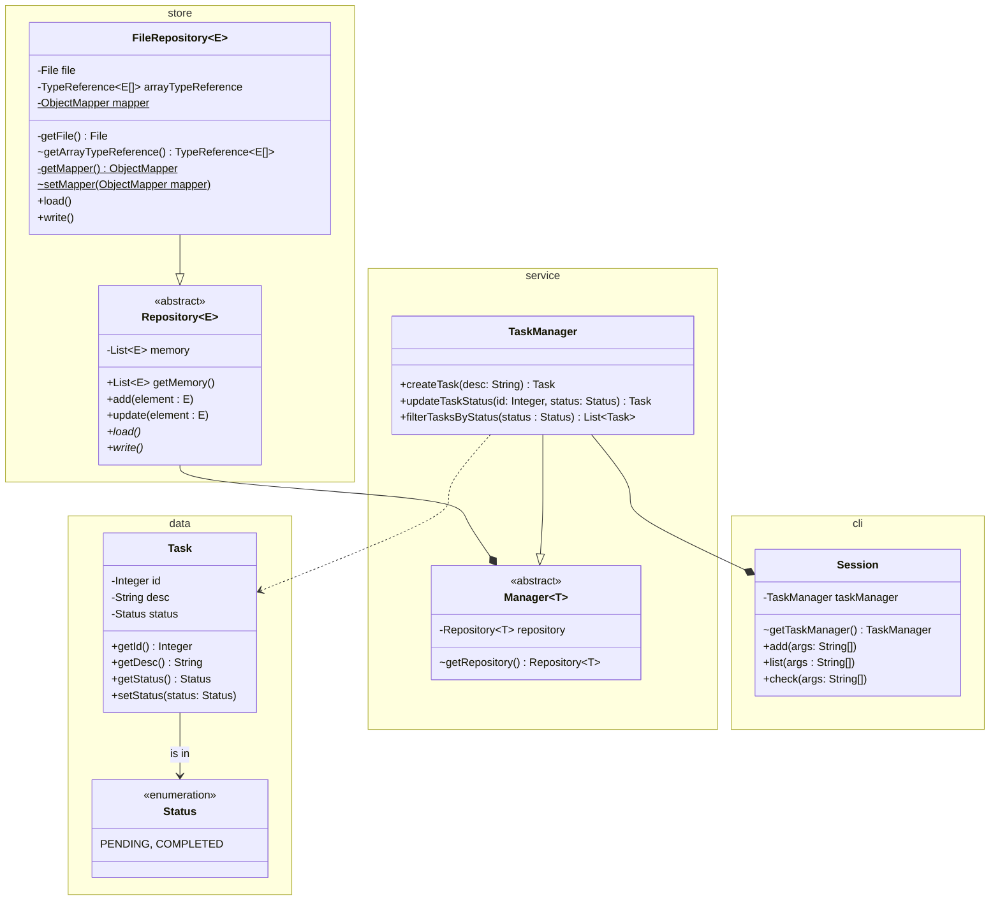

# white-noise

```mermaid
classDiagram
    namespace data {
        class Task {
            -Integer id
            -String desc
            -Status status
            +getId() Integer
            +getDesc() String
            +getStatus() Status
            +setStatus(status: Status)
        }
        class Status {
            <<enumeration>>
            PENDING, COMPLETED
        }
    }
    namespace store {
        class Repository~E~ {
            <<abstract>>
            -List~E~ memory
            +List~E~ getMemory()
            +add(element : E)
            +update(element : E)
            +load()*
            +write()*
        }
        class FileRepository~E~ {
            -File file
            -TypeReference~E[]~ arrayTypeReference
            -ObjectMapper mapper$
            -getFile() File
            ~getArrayTypeReference() TypeReference~E[]~
            -getMapper()$ ObjectMapper
            ~setMapper(ObjectMapper mapper)$
            +load()
            +write()
        }
    }
    namespace service {
        class Manager~T~ {
            <<abstract>>
            -Repository~T~ repository
            ~getRepository() Repository~T~
        }
        class TaskManager {
            +createTask(desc: String) Task
            +updateTaskStatus(id: Integer, status: Status) Task
            +filterTasksByStatus(status : Status) List~Task~
        }
    }
    namespace cli {
        class Session {
            -TaskManager taskManager
            ~getTaskManager() TaskManager
            +add(args: String[])
            +list(args : String[])
            +check(args: String[])
        }
    }
    Task --> Status : is in
    FileRepository --|> Repository
    Repository --* Manager
    TaskManager --|> Manager
    TaskManager ..> Task
    TaskManager --* Session
```
