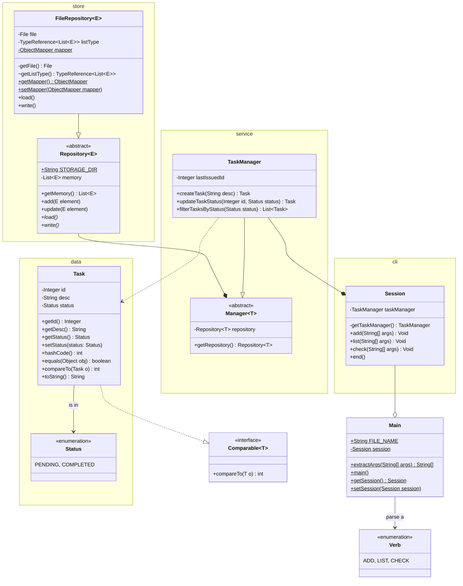

# white-noise

```mermaid
classDiagram
    class Comparable~T~ {
        <<interface>>
        +compareTo(T o) int
    }
    namespace data {
        class Task {
            -Integer id
            -String desc
            -Status status
            +getId() Integer
            +getDesc() String
            +getStatus() Status
            +setStatus(status: Status)
            +hashCode() int
            +equals(Object obj) boolean
            +compareTo(Task o) int
            +toString() String
        }
        class Status {
            <<enumeration>>
            PENDING, COMPLETED
        }
    }
    namespace store {
        class Repository~E~ {
            <<abstract>>
            +String STORAGE_DIR$
            -List~E~ memory
            +getMemory() List~E~ 
            +add(E element)
            +update(E element)
            +load()*
            +write()*
        }
        class FileRepository~E~ {
            -File file
            -TypeReference~List~E~~ listType
            -ObjectMapper mapper$
            -getFile() File
            ~getListType() TypeReference~List~E~~
            +getMapper()$ ObjectMapper
            +setMapper(ObjectMapper mapper)$
            +load()
            +write()
        }
    }
    namespace service {
        class Manager~T~ {
            <<abstract>>
            -Repository~T~ repository
            +getRepository() Repository~T~
        }
        class TaskManager {
            -Integer lastIssuedId
            +createTask(String desc) Task
            +updateTaskStatus(Integer id, Status status) Task
            +filterTasksByStatus(Status status) List~Task~
        }
    }
    namespace cli {
        class Session {
            -TaskManager taskManager
            -getTaskManager() TaskManager
            +add(String[] args) Void
            +list(String[] args) Void
            +check(String[] args) Void
            +end()
        }
    }
    class Main {
        +String FILE_NAME$
        -Session session$
        +extractArgs(String[] args)$ String[]
        +main()$
        +getSession()$ Session
        +setSession(Session session)$
    }
    class Verb {
        <<enumeration>>
        ADD, LIST, CHECK
    }
    Task --> Status : is in
    Task ..|> Comparable
    FileRepository --|> Repository
    Repository --* Manager
    TaskManager --|> Manager
    TaskManager ..> Task
    TaskManager --* Session
    Main --> Verb : parse a
    Session --o Main
```
